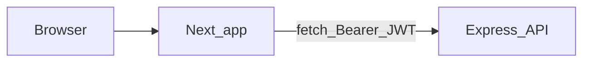

# Frontend Next.js + Tailwind + shadcn para Issue Tracker

## Contexto del backend

La API está en [backend/src/app.js](c:\Work\workshops\bps\desarrollo-practico-1\backend\src\app.js): `cors()` abierto, JSON body, swagger en `/swagger`, documentación alineada con [backend/src/docs/openapi.js](c:\Work\workshops\bps\desarrollo-practico-1\backend\src\docs\openapi.js).

- **Auth:** `POST /auth/register` (email, displayName), `POST /auth/login` (email), `GET /auth/me` con `Authorization: Bearer <jwt>`. Respuestas: `{ token, user }` en login/register; `{ user }` en `/me`.
- **Proyectos (todas protegidas):** `GET/POST /projects`, `GET/PATCH/DELETE /projects/:projectId`, `POST /projects/:projectId/members` (email, role). El detalle vía repositorio incluye `members` (con `user`) y `labels` — útil para asignatarios y etiquetas ([backend/src/modules/projects/projects.repository.js](c:\Work\workshops\bps\desarrollo-practico-1\backend\src\modules\projects\projects.repository.js)).
- **Issues:** `GET /projects/:projectId/issues` con query (`status`, `priority`, `assigneeId`, `q`, `page`, `pageSize`); respuesta `{ items, total, page, pageSize }` ([backend/src/modules/issues/issues.service.js](c:\Work\workshops\bps\desarrollo-practico-1\backend\src\modules\issues\issues.service.js)). `POST` crear, `GET/PATCH/DELETE /issues/:issueId`. Labels: `POST /projects/:projectId/labels`.
- **Comentarios:** `GET/POST /issues/:issueId/comments`, `PATCH .../comments/:commentId`. Listado paginado con `author` incluido en el listado ([backend/src/modules/comments/comments.repository.js](c:\Work\workshops\bps\desarrollo-practico-1\backend\src\modules\comments\comments.repository.js)).
- **Errores:** `{ error: string }` ([backend/src/shared/middlewares/errorHandler.js](c:\Work\workshops\bps\desarrollo-practico-1\backend\src\shared\middlewares\errorHandler.js)).

**Puerto:** [backend/src/server.js](c:\Work\workshops\bps\desarrollo-practico-1\backend\src\server.js) usa `PORT || 3000`, igual que Next por defecto. En desarrollo, conviene **fijar la API en otro puerto** (p. ej. `PORT=3001` en `.env` del backend) y que el frontend apunte allí con `NEXT_PUBLIC_API_URL=http://localhost:3001`.

## Estructura propuesta del frontend

- Carpeta nueva recomendada: **`frontend/`** en la raíz del repo (hermano de `backend/`).
- **Stack:** `create-next-app` (App Router, TypeScript, Tailwind, ESLint), luego `npx shadcn@latest init` siguiendo [`.agents/skills/shadcn/SKILL.md`](c:\Work\workshops\bps\desarrollo-practico-1\.agents\skills\shadcn\SKILL.md) (componentes como código fuente, reglas de formularios/composición).
- **Convención App Router:** rutas públicas bajo grupo `(auth)`; área logueada bajo `(app)` o `(dashboard)` con layout que comprueba sesión y redirige a login.

### Rutas y pantallas (MVP útil)

| Ruta | Propósito |
|------|-----------|
| `/login`, `/register` | Formularios que llaman a la API y guardan el JWT |
| `/` | Redirige a proyectos o login |
| `/projects` | Lista de proyectos; crear proyecto (name, key, description) |
| `/projects/[projectId]` | Overview / enlaces; opcional: edición proyecto y “añadir miembro” si el usuario es owner (backend exige owner para patch/delete/members) |
| `/projects/[projectId]/issues` | Tabla/lista con filtros (status, priority, búsqueda `q`) y paginación; crear issue (dialog o página) |
| `/issues/[issueId]` | Detalle issue: editar campos, asignar miembro (dropdown desde `members` del proyecto), etiquetas (`labelIds`); borrar issue |
| Comentarios en detalle | Listar vía `GET /issues/:id/comments` (mejor que confiar solo en `comments` embebidos en `GET /issues/:id`, que no incluyen `author`) |

### Capa HTTP y tipos

- **`lib/api/client.ts`:** `baseURL` desde `process.env.NEXT_PUBLIC_API_URL`, helper `apiFetch(path, { method, body, token })` que añade `Authorization` si hay token, parsea JSON y lanza error legible con `error` del backend.
- **Auth en cliente:** guardar `token` en `localStorage` (o `sessionStorage`) tras login/register; hidratar estado con `GET /auth/me` al cargar el layout protegido. Alternativa más segura (fase 2): Route Handler que establezca cookie httpOnly y haga de BFF — **no requerida** para alinear con la API actual.
- **Tipos TypeScript:** interfaces que reflejen respuestas Prisma-ish (User, Project, Issue con `issueLabels[].label`, etc.) para evitar `any` en tablas y formularios.

### UI shadcn (orientativo)

Añadir con el CLI según necesidad: **Button**, **Input**, **Card**, **Form** (+ zod + react-hook-form alineado con [forms.md](c:\Work\workshops\bps\desarrollo-practico-1\.agents\skills\shadcn\rules\forms.md)), **Table**, **Badge** (status/priority), **Select** o **DropdownMenu**, **Dialog** (crear issue / label), **Sonner** (toasts), **Skeleton** (loading), **Sidebar** o **Sheet** (navegación móvil), **Separator**, **Avatar** (miembros). Usar tokens semánticos de tema, sin `dark:` manuales ([styling.md](c:\Work\workshops\bps\desarrollo-practico-1\.agents\skills\shadcn\rules\styling.md)).

### Flujo de datos (alto nivel)

En MVP, las llamadas pueden ser **desde Client Components** tras login (simple y compatible con CORS). Opcionalmente, Server Actions que llamen a la misma `NEXT_PUBLIC_API_URL` **sin** exponer el token al cliente requerirían cookie/sesión servidor — fuera del alcance mínimo.

## Entregables concretos

1. Scaffold `frontend/` con Next 15+, Tailwind, TS.
2. `shadcn` init + componentes mínimos listados arriba.
3. `.env.local.example` con `NEXT_PUBLIC_API_URL=http://localhost:3001` (o el puerto elegido).
4. Implementación de rutas y componentes de página descritos; manejo de 401 → limpiar token y redirect login.
5. README breve en `frontend/` (o sección en README raíz): comanda `npm run dev`, variable de entorno, y recordatorio de **no** arrancar API y Next ambos en 3000.

## Fases opcionales (post-MVP)

- Página de ajustes de proyecto (PATCH, invitar miembro, gestión de labels dedicada).
- Optimistic updates o TanStack Query para cache/refetch.
- Generar tipos cliente desde OpenAPI (`/swagger` JSON) si se exporta el spec como archivo.
