# Manual de usuario — Issue Tracker

Guía paso a paso para usar la aplicación **Issue Tracker**: un gestor de proyectos e incidencias (issues) pensado para el workshop de desarrollo con IA en Cursor.

---

## Índice

1. [¿Qué es Issue Tracker?](#1-qué-es-issue-tracker)
2. [Cómo acceder a la aplicación](#2-cómo-acceder-a-la-aplicación)
3. [Pantalla de inicio](#3-pantalla-de-inicio)
4. [Crear una cuenta](#4-crear-una-cuenta)
5. [Iniciar sesión](#5-iniciar-sesión)
6. [El panel principal (Dashboard)](#6-el-panel-principal-dashboard)
7. [Navegación](#7-navegación)
8. [Gestionar proyectos](#8-gestionar-proyectos)
9. [Gestionar issues](#9-gestionar-issues)
10. [Datos de ejemplo del workshop](#10-datos-de-ejemplo-del-workshop)
11. [Preguntas frecuentes](#11-preguntas-frecuentes)

---

## 1. ¿Qué es Issue Tracker?

Issue Tracker es una aplicación web que te permite:

- **Organizar trabajo en proyectos** con nombre, clave corta y descripción.
- **Registrar issues** (tareas, bugs o mejoras) dentro de cada proyecto.
- **Dar seguimiento** al estado, prioridad y persona asignada de cada issue.
- **Colaborar** con otros miembros del equipo en los mismos proyectos.

La interfaz está en español e inglés mezclados (por ejemplo, los botones de registro dicen "Register" y "Sign in"), pero los flujos principales son intuitivos.

---

## 2. Cómo acceder a la aplicación

### Requisitos

- Un navegador web moderno (Chrome, Firefox, Edge o Safari).
- Que el **backend** y el **frontend** estén en ejecución (ver [README del proyecto](../../README.md)).

### URLs habituales

| Servicio   | URL por defecto              |
|-----------|------------------------------|
| Aplicación web | `http://localhost:3001` |
| API backend    | `http://localhost:3000` |
| Documentación API (Swagger) | `http://localhost:3000/swagger` |

> **Nota:** Si cambiaste el puerto del backend, asegurate de que `NEXT_PUBLIC_API_URL` en el frontend apunte a la URL correcta.

---

## 3. Pantalla de inicio

Al abrir la aplicación verás la página de bienvenida:

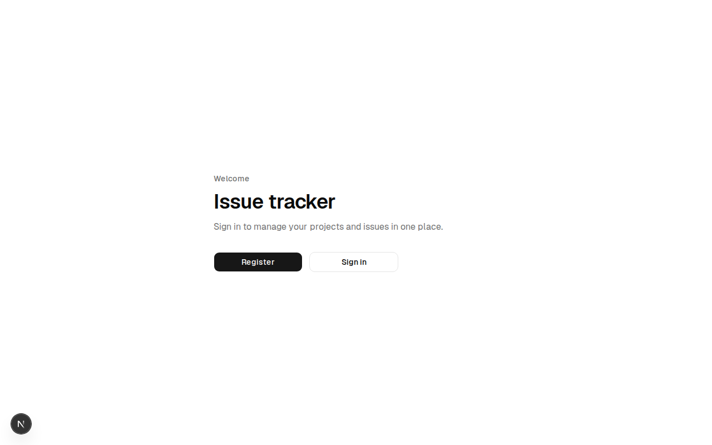

Desde aquí podés:

| Botón      | Qué hace                                      |
|-----------|------------------------------------------------|
| **Register** | Ir al formulario de registro de cuenta nueva |
| **Sign in**  | Ir al formulario de inicio de sesión         |

Si ya tenés sesión activa, en lugar de estos botones verás **Go to dashboard**.

---

## 4. Crear una cuenta

1. En la pantalla de inicio, hacé clic en **Register**.
2. Completá el formulario:

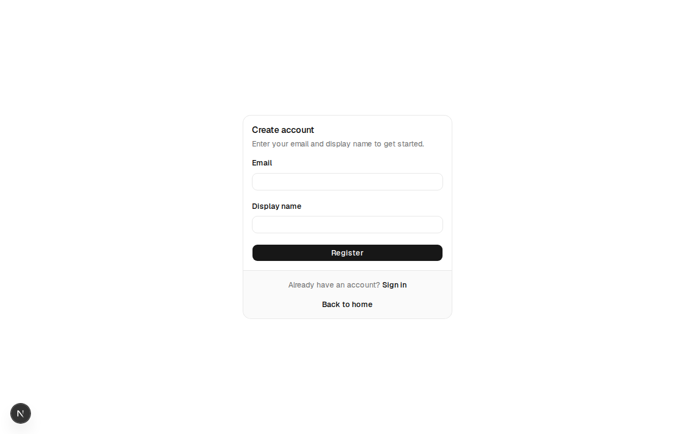

| Campo            | Descripción                                      |
|-----------------|--------------------------------------------------|
| **Email**        | Tu correo electrónico (debe ser válido).         |
| **Display name** | Nombre visible para el resto del equipo.         |

3. Hacé clic en **Register**.
4. Si todo sale bien, serás redirigido automáticamente al **Dashboard**.

> **Importante:** En este workshop la autenticación es simplificada: **no hay contraseña**. Solo necesitás tu email para iniciar sesión después.

---

## 5. Iniciar sesión

1. En la pantalla de inicio, hacé clic en **Sign in**.
2. Ingresá el email con el que te registraste.

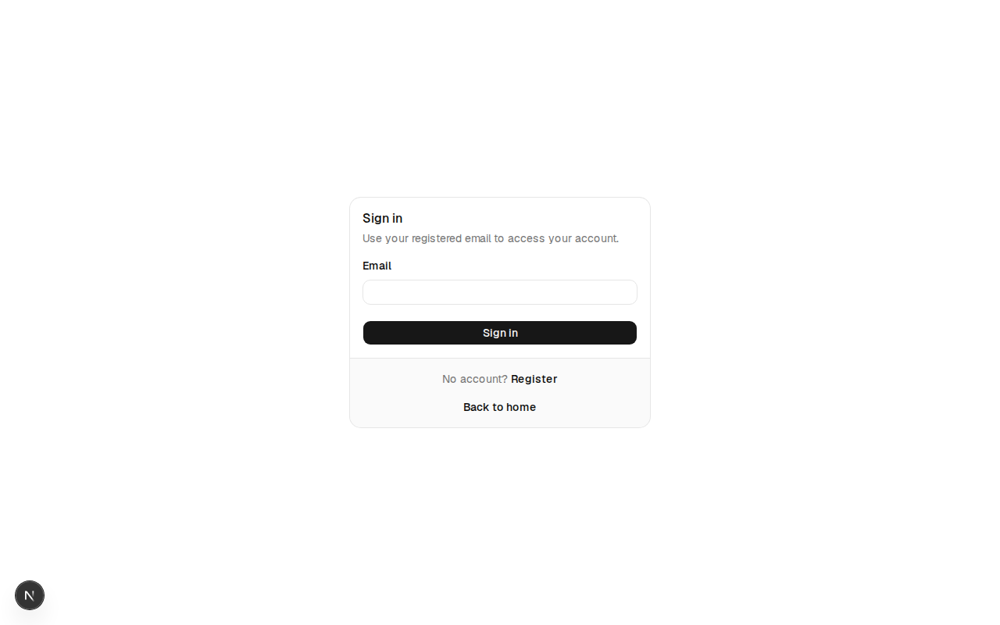

3. Hacé clic en **Sign in**.
4. Serás llevado al Dashboard.

Si el email no está registrado, verás un mensaje de error. En ese caso, usá **Register** para crear la cuenta primero.

---

## 6. El panel principal (Dashboard)

Una vez autenticado, llegás al Dashboard:

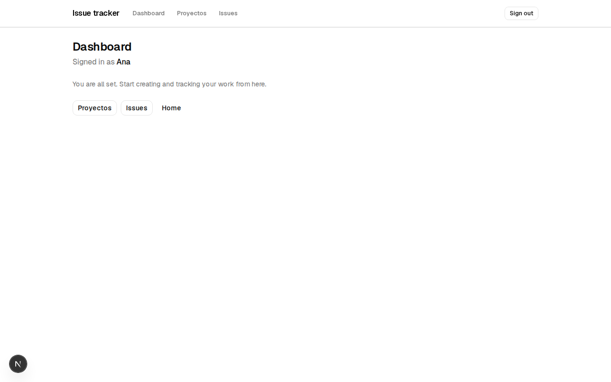

Aquí verás:

- Un saludo con tu **nombre** o email.
- Accesos rápidos a **Proyectos** e **Issues**.
- Un enlace para volver al inicio (**Home**).

El Dashboard es el punto de partida para todo el trabajo diario.

---

## 7. Navegación

En la parte superior de la aplicación (cuando estás logueado) hay una barra de navegación fija:

```
Issue tracker  |  Dashboard  |  Proyectos  |  Issues  |  [Sign out]
```

| Enlace        | Destino                              |
|--------------|---------------------------------------|
| **Issue tracker** | Vuelve al Dashboard              |
| **Dashboard**     | Panel principal                  |
| **Proyectos**     | Listado de todos tus proyectos   |
| **Issues**        | Listado de issues                |
| **Sign out**      | Cierra la sesión actual          |

---

## 8. Gestionar proyectos

### 8.1 Ver el listado de proyectos

Hacé clic en **Proyectos** en la barra superior o en el botón del Dashboard.

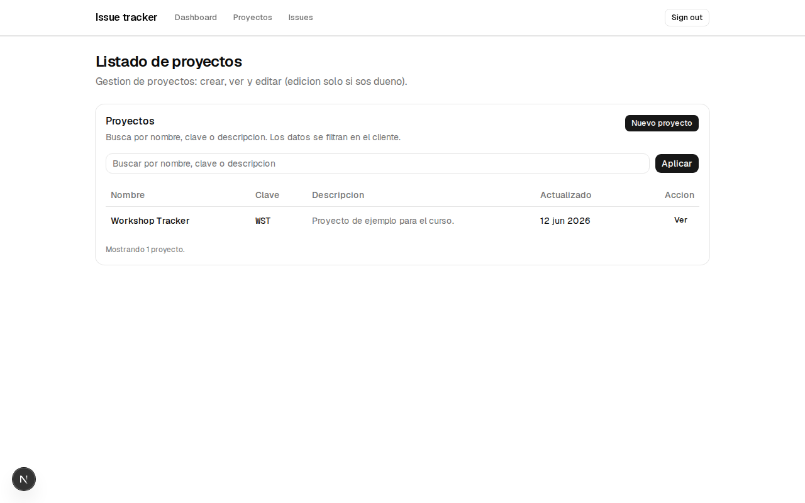

La pantalla muestra una tabla con:

| Columna        | Significado                              |
|---------------|------------------------------------------|
| **Nombre**     | Nombre descriptivo del proyecto          |
| **Clave**      | Identificador corto (ej. `WST`)          |
| **Descripción**| Texto opcional sobre el proyecto         |
| **Actualizado**| Fecha de la última modificación          |
| **Acción**     | Botón **Ver** para abrir el detalle      |

#### Buscar proyectos

1. Escribí en el campo de búsqueda (nombre, clave o descripción).
2. Hacé clic en **Aplicar**.
3. La tabla se filtra en el momento (sin recargar la página).

### 8.2 Crear un proyecto nuevo

1. En el listado, hacé clic en **Nuevo proyecto**.

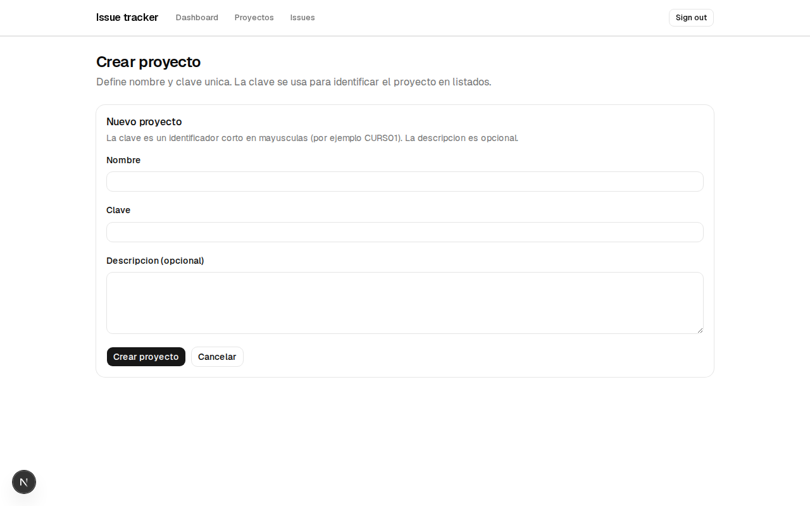

2. Completá los campos:

| Campo            | Obligatorio | Descripción                                      |
|-----------------|-------------|--------------------------------------------------|
| **Nombre**       | Sí          | Nombre del proyecto (ej. "Mi App").              |
| **Clave**        | Sí          | Código corto en mayúsculas (ej. `CURS01`).       |
| **Descripción**  | No          | Texto libre sobre el objetivo del proyecto.      |

3. Hacé clic en **Crear proyecto**.
4. Serás redirigido al detalle del proyecto recién creado.

> Al crear un proyecto, **vos sos el dueño (OWNER)** y tenés permisos completos de edición.

### 8.3 Ver y editar un proyecto

Hacé clic en **Ver** en cualquier fila del listado.

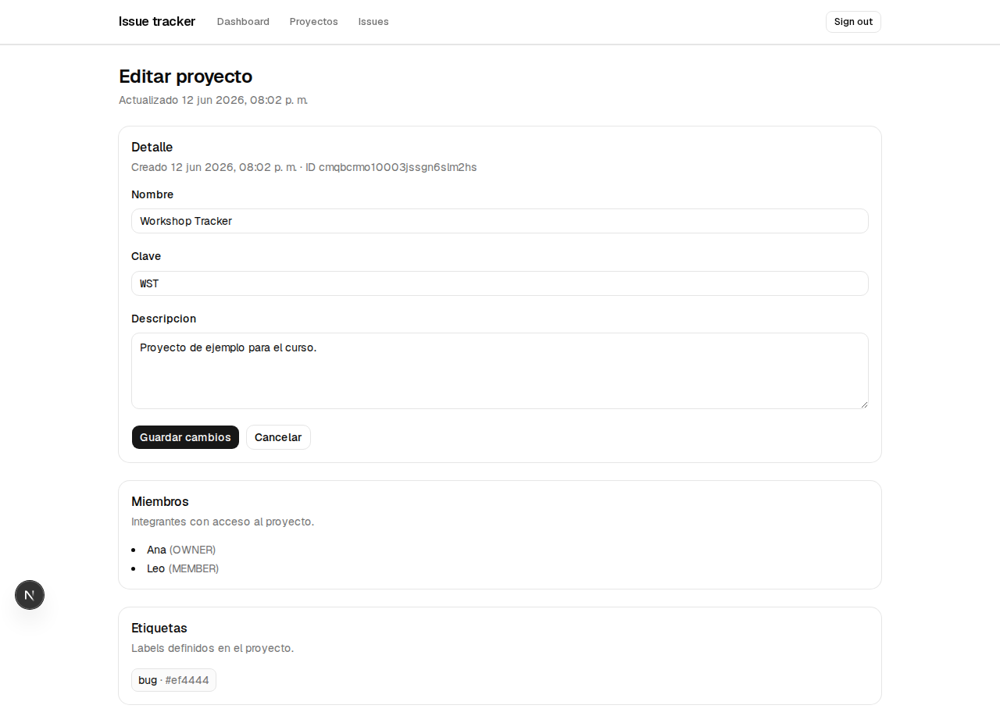

En esta pantalla encontrarás tres secciones:

#### Detalle

Si sos el **dueño** del proyecto, podés editar:

- Nombre
- Clave
- Descripción

Hacé clic en **Guardar cambios** para aplicar las modificaciones.

Si **no sos el dueño**, la pantalla es de solo lectura (verás el mensaje *"Solo lectura (no sos dueño)"*).

#### Miembros

Lista de personas con acceso al proyecto y su rol:

| Rol      | Permisos principales                    |
|---------|-----------------------------------------|
| **OWNER**  | Puede editar el proyecto               |
| **MEMBER** | Puede ver el proyecto y trabajar en issues |

#### Etiquetas

Muestra las etiquetas (labels) definidas en el proyecto, con su nombre y color.

---

## 9. Gestionar issues

Un **issue** es una tarea, bug o mejora dentro de un proyecto.

### 9.1 Ver el listado de issues

Hacé clic en **Issues** en la barra superior.

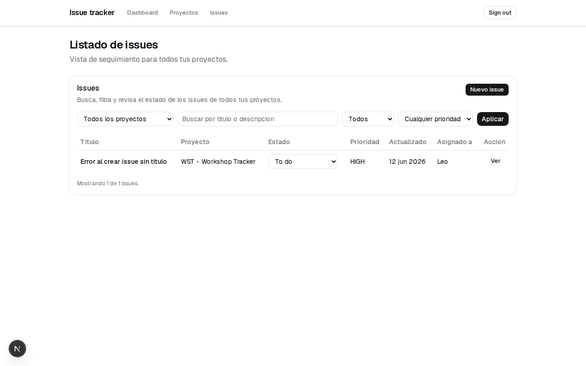

La tabla muestra:

| Columna        | Significado                                    |
|---------------|------------------------------------------------|
| **Título**     | Nombre del issue                               |
| **Proyecto**   | Proyecto al que pertenece                      |
| **Estado**     | `To do`, `In progress` o `Done`                |
| **Prioridad**  | `LOW`, `MEDIUM` o `HIGH`                       |
| **Actualizado**| Fecha de última modificación                   |
| **Asignado a** | Persona responsable (o "Sin asignar")          |
| **Acción**     | Botón **Ver** para abrir el detalle            |

#### Filtrar issues

Usá los controles superiores:

1. **Proyecto** — Todos los proyectos o uno específico.
2. **Búsqueda** — Por título o descripción.
3. **Estado** — To do, In progress, Done o Todos.
4. **Prioridad** — Low, Medium, High o Cualquier prioridad.
5. Hacé clic en **Aplicar** para actualizar el listado.

#### Cambiar el estado desde el listado

Podés cambiar el estado de un issue directamente con el menú desplegable en la columna **Estado**, sin entrar al detalle. El cambio se guarda automáticamente.

### 9.2 Crear un issue nuevo

1. En el listado, hacé clic en **Nuevo issue**.

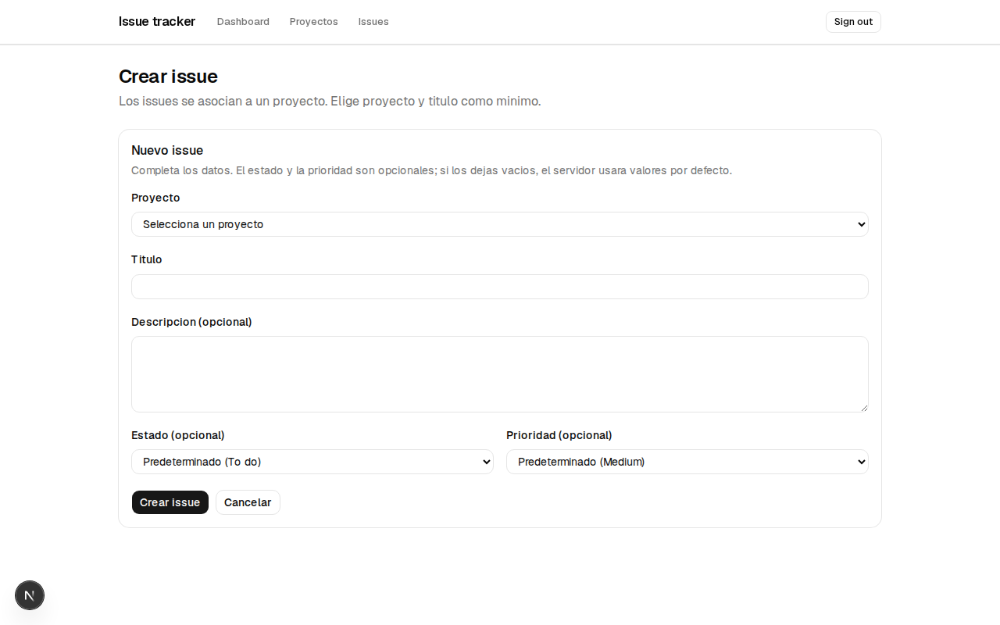

2. Completá el formulario:

| Campo            | Obligatorio | Descripción                                      |
|-----------------|-------------|--------------------------------------------------|
| **Proyecto**     | Sí          | Seleccioná a qué proyecto pertenece.             |
| **Título**       | Sí          | Nombre breve del issue.                          |
| **Descripción**  | No          | Detalle adicional.                               |
| **Estado**       | No          | Por defecto: *To do*.                            |
| **Prioridad**    | No          | Por defecto: *Medium*.                           |

3. Hacé clic en **Crear issue**.
4. Volvés al listado de issues con el nuevo registro visible.

> Si no tenés proyectos, primero debés crear uno en la sección **Proyectos**.

### 9.3 Ver y editar un issue

Hacé clic en **Ver** en cualquier fila.

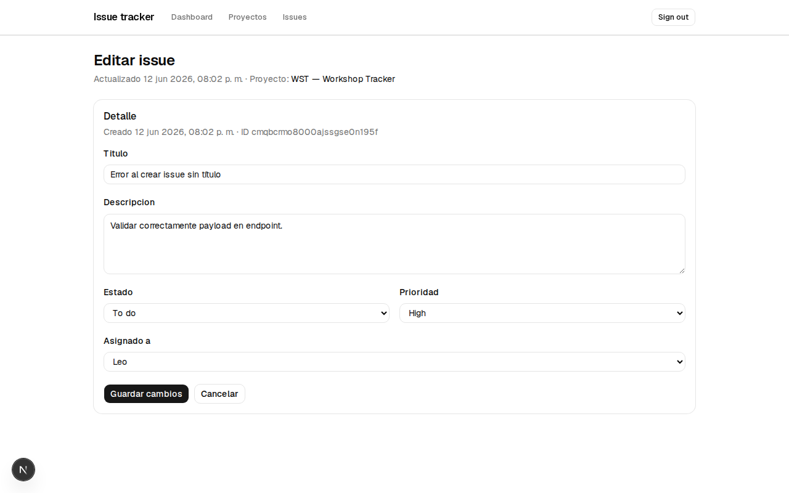

Podés modificar:

| Campo            | Opciones / notas                               |
|-----------------|------------------------------------------------|
| **Título**       | Texto libre                                    |
| **Descripción**  | Texto largo opcional                           |
| **Estado**       | To do · In progress · Done                     |
| **Prioridad**    | Low · Medium · High                            |
| **Asignado a**   | Miembros del proyecto o "Sin asignar"          |

Hacé clic en **Guardar cambios** para confirmar, o **Cancelar** para volver al listado sin guardar.

---

## 10. Datos de ejemplo del workshop

Si ejecutaste el comando de seed del backend (`npm run prisma:seed`), la base de datos incluye datos de prueba:

### Usuarios

| Email              | Nombre |
|-------------------|--------|
| `ana@workshop.dev` | Ana    |
| `leo@workshop.dev` | Leo    |

Para probar la app, iniciá sesión con cualquiera de estos emails (sin contraseña).

### Proyecto de ejemplo

| Campo         | Valor                          |
|--------------|--------------------------------|
| **Nombre**    | Workshop Tracker               |
| **Clave**     | WST                            |
| **Descripción** | Proyecto de ejemplo para el curso. |
| **Dueño**     | Ana                            |
| **Miembro**   | Leo                            |

### Issue de ejemplo

| Campo         | Valor                                      |
|--------------|--------------------------------------------|
| **Título**    | Error al crear issue sin título            |
| **Estado**    | To do                                      |
| **Prioridad** | High                                       |
| **Asignado**  | Leo                                        |
| **Etiqueta**  | bug                                        |

---

## 11. Preguntas frecuentes

### ¿Necesito contraseña para entrar?

No. En este entorno de workshop la autenticación usa solo el email. Escribí tu email registrado y hacé clic en **Sign in**.

### No veo ningún proyecto ni issue

Posibles causas:

1. **No ejecutaste el seed** — Corré `npm run prisma:seed` en la carpeta `backend`.
2. **Tu usuario es nuevo** — Creá un proyecto desde **Nuevo proyecto** y luego un issue.
3. **El backend no está corriendo** — Verificá que la API responda en `http://localhost:3000`.

### Aparece un error al cargar datos

- Revisá que el backend esté activo.
- Confirmá que `NEXT_PUBLIC_API_URL` en el frontend apunte al puerto correcto.
- Usá el botón **Reintentar** que aparece en pantalla.

### ¿Puedo editar un proyecto que no es mío?

Solo si sos el **OWNER** (dueño). Los miembros con rol **MEMBER** pueden ver el proyecto y trabajar en issues, pero no editar sus datos generales.

### ¿Cómo cierro sesión?

Hacé clic en **Sign out** en la esquina superior derecha de la barra de navegación.

### ¿Dónde está la documentación técnica de la API?

En Swagger: `http://localhost:3000/swagger` (con el backend en ejecución).

---

## Resumen rápido del flujo de trabajo

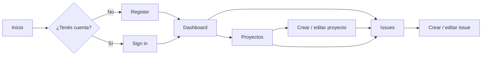

1. **Registrate** o **iniciá sesión** con tu email.
2. **Creá un proyecto** (o usá el de ejemplo del seed).
3. **Creá issues** dentro del proyecto.
4. **Actualizá el estado** y asigná responsables según avance el trabajo.
5. **Filtrá y buscá** en el listado para encontrar lo que necesitás.

---

*Manual generado para el workshop **Desarrollo con IA en Cursor** — Issue Tracker.*
